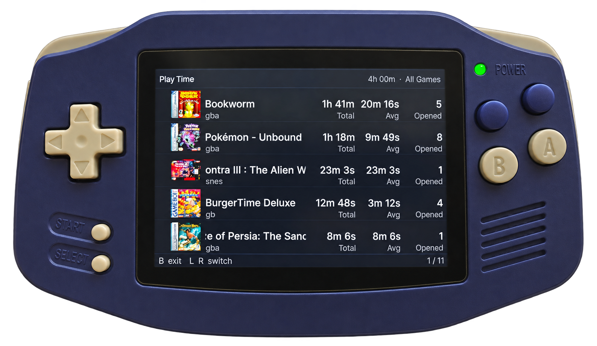

# PlayTime

A play time viewer for **Knulli CFW** on Anbernic handhelds.

<p align="center">
  <a href="https://github.com/unitreign/playtime/releases/latest"></a>
  <a href="LICENSE"></a>
  <a href="https://ko-fi.com/unitreign"></a>
  <a href="https://github.com/unitreign/playtime/releases"></a>
</p>

Knulli tracks play time in each system's `gamelist.xml` — but there is no UI to see it. PlayTime reads that data and shows your most-played games in a shelf-style view, sorted by time, across all consoles or filtered to one.

<p align="center">
  
  <br>
  <sub>Background removed with AI — device photo taken from my own setup.</sub>
  <br><br>
  <a href="https://www.youtube.com/watch?v=YBc3jUqJdCs">▶ Watch demo</a>
</p>

## Install

1. Download the latest release from the **[Releases](https://github.com/unitreign/playtime/releases)** page.
2. Extract the zip — you'll get a `PlayTime` folder.
3. Copy it to `/userdata/roms/tools/` on your device.
4. Refresh Knulli's game list so the tool appears under **Tools**.
5. Launch **PlayTime** from the Tools menu.

No setup required. If you have played games on Knulli, they will appear immediately.

### Folder structure after install

```
/userdata/roms/tools/
└── PlayTime/
    ├── playtime          ← the binary
    ├── playtime.sh       ← launch script
    └── icons/
        └── playtime.png  ← icon shown in Knulli's menu
```

## Features

### Library View

* **All Games** — every game with recorded play time, sorted by total time
* **Per-console views** — switch between consoles with L and R
* Game names and cover art pulled from each system's `gamelist.xml`
* Play count and average session length shown alongside total time

### UI

* Monochrome design — no colour, no clutter
* Adapts to any screen resolution — tested on RG34XX and RG35XXSP
* Controller-native: no touch required
* B to exit, L / R to switch consoles

## How It Works

Knulli records `<gametime>` and `<playcount>` in each system's `gamelist.xml` as you play. PlayTime reads those files across all your systems, filters out anything too short to count, and renders the results as a sorted list.

No database, no background processes, no hooks. Everything PlayTime shows is data Knulli already collected.

## Uninstall

Delete the `PlayTime` folder from `/userdata/roms/tools/`. Nothing else was installed.

## System Details

|               |                                                              |
| ------------- | ------------------------------------------------------------ |
| **Firmware**  | Knulli CFW (Batocera-based)                                  |
| **Devices**   | All Knulli-supported devices · Tested on RG34XX and RG35XXSP |
| **Data**      | Reads from each system's `gamelist.xml`                      |
| **Install**   | `/userdata/roms/tools/PlayTime/`                             |
| **License**   | GPL-3.0                                                      |

## Known Issues

### Corrupted gametime values

Knulli (and the Batocera EmulationStation it is based on) has a known bug where `<gametime>` in `gamelist.xml` can be written as a garbage value — typically a Unix timestamp or an overflowed number — instead of actual elapsed seconds. This usually affects games played for longer sessions and appears to be triggered by the scraper or by ES itself in certain conditions.

PlayTime skips any game whose recorded time exceeds 2,000 hours. Games affected by this bug will not appear in the list until Knulli writes a corrected value. There is no fix on our end — the data has to be correct in `gamelist.xml` first.

If a game you have played is missing, open its `gamelist.xml` and check the `<gametime>` value. An obviously wrong number (9 digits or more) confirms the bug.

## License

PlayTime is licensed under the **GNU General Public License v3.0**.

See [LICENSE](LICENSE) for the full license text.
